# MetroFare
> A minecraft bukkit (spigot) plugin that creates a fare system used in subway/metro.


MetroFare is a highly customizable fare system that tries to mimic the [Octopus Card](https://en.wikipedia.org/wiki/Octopus_card)
and ticket system used in [Mass Transit Railway](https://en.wikipedia.org/wiki/MTR) in Hong Kong. This plugin is most
suitable for fare system in minecraft railways.

This system includes a Debit Card, which is a IC Card that could be topped up and used to pay for charges. Single Ride
tickets are also included if players opt to not use a Debit Card.

This plugin allows "Company" (The body for collecting fare in this plugin) to collect fare based on the following methods:
```
1. Zone
  - A intra-zone charge and inter-zone charge is defined.
  - Fare is calulated by <inter-zone-charge> * (DEST_ZONE - DEPT_ZONE) + <intra-zone-charge>

2. Uniform
  - A single uniform fare is defined.
  - Fare is the same and independent on which station the passenger enter/exit.

3. Abs_Coordinate
  - A station coordinate is defined for each station
  - A multiplier and constant is defined for the system.
  - Fare is calulcated by the absolute coordinate between station coordinates with the following formula:
    - DIFF = sqrt((destX - deptX)^2 + (destZ - deptZ)^2)
    - Fare = Multiplier * DIFF + Constant
  - This fare mode is good for simulating shortest distance fare policy.

4. Dijkstra
  - Each station is defined as a vertex.
  - A edge should be created between the previous and next station on a railway line.
  - A fare is assiciated with each edge.
  - Final fare is calculated by Dijstra Algorithum between the departure station vertex and destination station vertex.
  - This fare mode is good for simulating shortest driving (rail) distance fare policy.

5. FareTable
  - A fare table is created for the railway system
  - The fare will be charged based on the fare table.
```

A few points to note:
```
1. The minimum denomination of fare in the plugin is 0.001 (current-unit),
   to avoid double (decimal) value prescion problems.

2. Vault integration is supported if vault is installed. If no vault supporting economy plugin is instlled, the DebitCard and Ticket systems would still work.
```

## Download
You can download the plugin from spigot-mc forum [here](https://www.spigotmc.org/resources/metrofare.105346/).

## Usage example
### 1. Setup your own fare system
##### 1.1 Create your own company.
To setup a fare system, one must first create a company. It could be created via the following command:
```mclang
/company
```
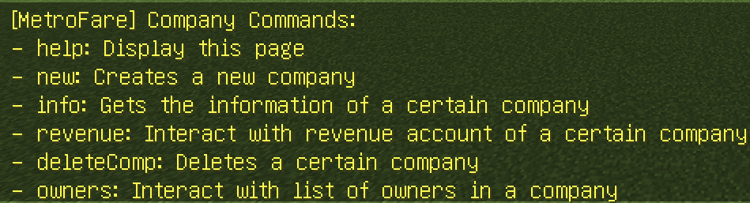

Different company requires different information upon creation:

For **Zone/Abs_Coordinate** Company:
```mclang
/company new Zone
/company new Abs_Coordinate
```


For **Dijkstra** Company:
```mclang
/company new Dijkstra
```


For **FareTable** Company:
```mclang
/company new FareTable
```


For **Uniform** Company:
```mclang
/company new Uniform
```


##### 1.2 Create Entry/Exit Gates
For the fare system to function, entry and exit gates should be created in stations with the following syntax.
Type the following lines into a WallSign.

**Entry Gate**:
```yml
[MetroFareIn] # Configurable in config.yml
<Company Name>,<Entry Data (if necessary)>
```

**Exit Gate**:
```yml
[MetroFareOut] # Configurable in config.yml
<Company Name>,<Entry Data (if necessary)>
```

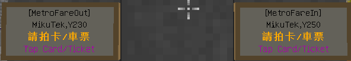

Line 3 and 4 is *automatically generated*. 

A WallSign could also be placed within 3 blocks below the gate signs to temporarily set up to 2 blocks at specific location 
during gate open. Such Offset is relative to the position of the **gate sign**.

Syntax of such sign is as follows:

U : Axis **parallel** to WallSign \
W : Axis **perpendicular** to WallSign
```yml
<Offset U>,<OffsetY>,<OffsetW>
<Offset U>,<OffsetY>,<OffsetW>
<Material During Gate OPEN>
<Material When Gate CLOSE>
```

### 2. Creating DataTable for Dijkstra Companies / Fare Table for FareTable Companies
#### 2.1 DataTables
A *datatable* is a file that represents the graph(the relationship) between different stations.
Dijkstra graphs looks something like this:


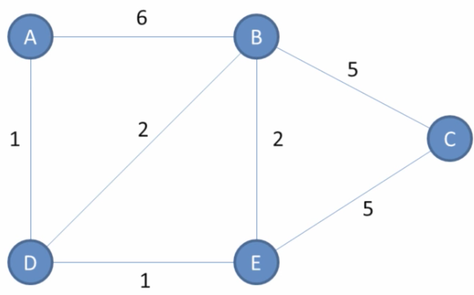

In this plugin, ```A B C D E``` represent different stations, and the lines in between
represent paths to go between stations. The number in on the line represents the fare to travel on this line (weight).

A *datatable* could be created via in-game commands:
```mclang
/data
```
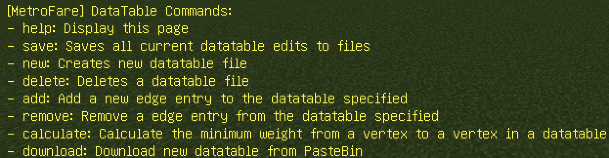

This command creates a new *datatable*.
```mclang
/data new
```


To add a vertex/edge, do the following:
```mclang
/data add
```


Vertex will automatically be created if it is not yet defined in the *datatable*.

#### 2.2 FareTables
To create a FareTable, start with an Excel file in the following format. Rows and Columns in the table represent the 
Departure and Arrival Stations respectively. 

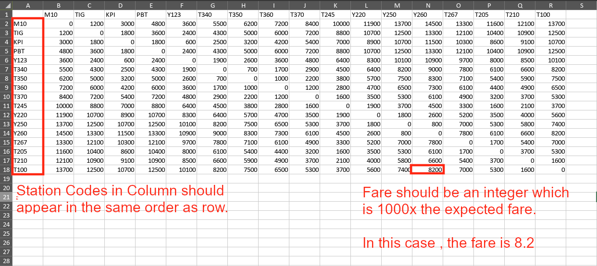

Save the file as ```.csv``` file format. 

Open the file with a text editor, copy everything, and upload to pastebin. You should get a link.
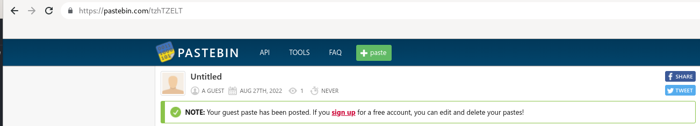

Copy the link, fill in the required arguments and execute the following command:
```mclang
/faretable download
```


Last but not least, load the fare table with the following command:
```mclang
/faretable load <name_of_file>
```

### 3. Create a DebitCard Editor / One-Time Payment Machine.
#### 3.1 DebitCard Editor
> DebitCard Editor requires a vault-supporting economy plugin to be installed.

The plugin comes with a basic DebitCard Editor to do the following:
```
1. Issue new DebitCard
2. Top-Up a DebitCard from player balance
3. Bank-In to player balance from DebitCard
4. View transaction history
5. Configure auto Top-Up (enable/disable, Top-Up amount, daily limit})
```
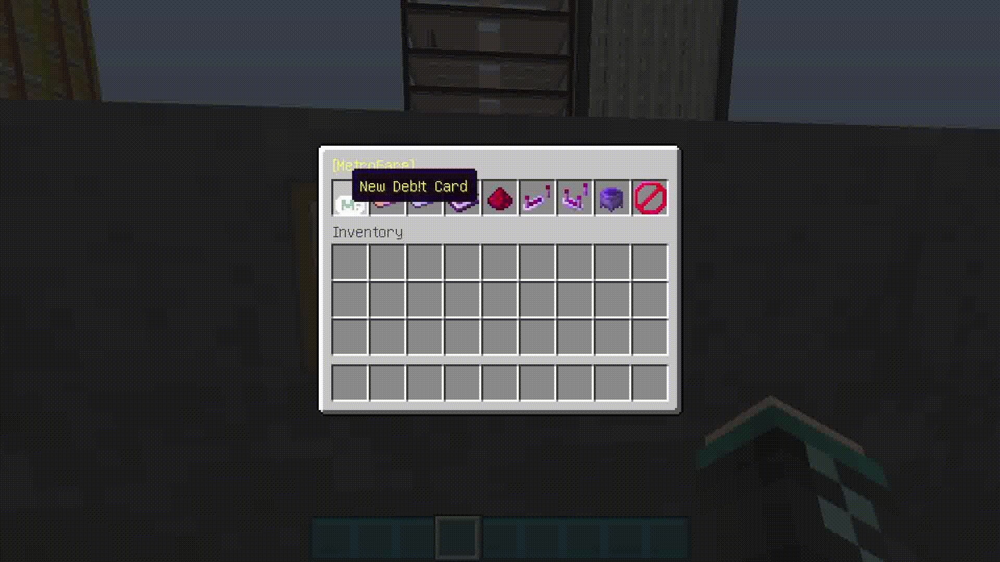

Type the following lines into a WallSign:
```yml
[MetroFareDCE] # Configurable in config.yml
```
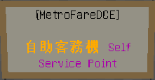

Other lines are *automatically generated*.

> Note that the DCE is intended for lazy people to use. It is not very customizable.
> > Should you need a customized DCE, create your own with the Command/Java API

#### 3.2 One-Time Payment Machine
To create a One-Time Payment Machine, type the following lines into a WallSign:
```yml
[MetroFareOTP] # Configurable in config.yml
<Company Name>,<FareAmount>
```
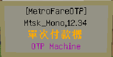

Other lines are *automatically generated*.

### 4. Issue DebitCard/Ticket via command.
#### 4.1 Debit Card Commands
DebitCard could be issued / edited using the following command:
```mclang
/debitcard
```
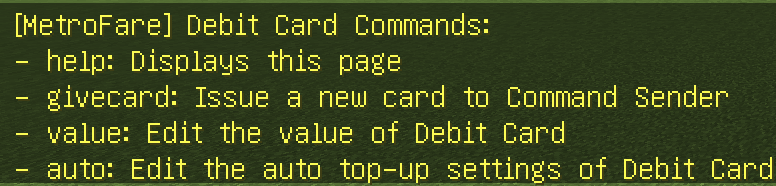

Tickets could be issued using the following command:
```mclang
/ticket
```
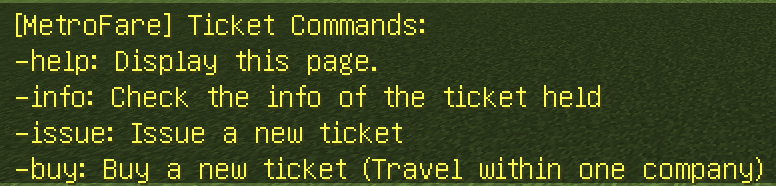

Refer to tab completion instructions for detailed used of the commands.

### 5. Create a DebitCard validator.
> This feature requires TrainCarts / MikuCore to be installed.

A DebitCard validator allows automatic exit and re-entry of a debit card, which may be useful for
inter company railways.

A example is shown below:
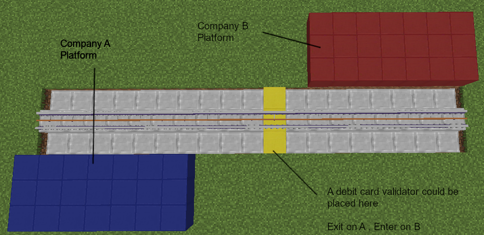

To create a DebitCard validator, place a Sign/WallSign **according to rules defined by MikuCore / TrainCarts** for
Vanilla and TrainCarts variant respectively.

Vanilla (Requires MikuCore to be installed):
```yml
[MetroFareValidator]

<Company From>, <Company Data From>
<Company To>, <Company Data To>
```

TrainCarts (Requires TrainCarts to be installed):
```yml
[+train]
validator
<Company From>, <Company Data From>
<Company To>, <Company Data To>
```

### 6. Fence Gate Locking


Placing a STRUCTURE_VOID above any fence gate would prevent it from being opened by player directly. 
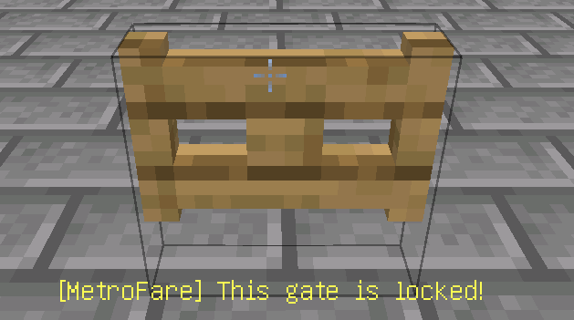

It can still be opened by redstone.

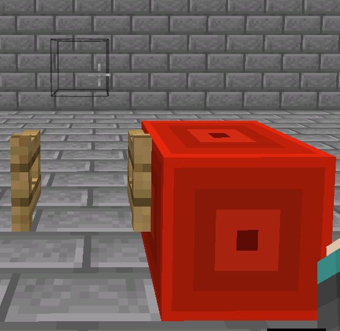

### 7. Permissions
The following permission notes are provided to limit access to certain parts of the plugin.
```yml
gate: # Allows player to build Entry/Exit Gates, One-Time Payment Machine, and DebitCard Validator.
database: # Allows player to edit DataTable/FareTable
fence: # Allows player to use the fence gate locking feature.
ticketing: # Allows player to place DebitCardEditor, and use Ticket/DebitCard related commands.
```

### Finally, if you don't know how to use a command, try follow the tab completions.

## API
You can customize the implementation of the plugin in your sever in various ways.

### 1. Command API (Skript / Minecraft Command Blocks)
The following commands could be useful to you.
```mclang
/valueaddmachine <player_name> <...>  # Command for DebitCard related process to player.

/vending <player_name> <...> # Command for issuing ticket to player.
```
#### 1.1 Skript
To execute the command in Skript, do the following :
```mclang
execute console command "PUT THE COMMAND HERE"
```
Use ```%{VAR_NAME}%``` if you need to use variables.

#### 1.2 Command Block
The following tags could be used in place of player name in command blocks.
```mclang
@a : For all players in the server.
@p : For the neareast player to the command block.
```

### 2. Java (Java / Kotlin)
> There is currently no java api. However, you could call the functions within the plugin via adding it to source.
#### 2.1 Maven
Add the following repository:
```xml
<repository>
    <id>jitpack.io</id>
    <url>https://jitpack.io</url>
</repository>
```

Add the following dependency (replace PLUGIN_VERSION):
```xml
<dependency>
    <groupId>com.github.Hasunemiku2015</groupId>
    <artifactId>MetroFare</artifactId>
    <version>PLUGIN_VERSION</version>
    <scope>provided</scope>
</dependency>
```

#### 2.2 Gradle Kotlin DSL
Add the following repository:
```kotlin
maven(uri("https://jitpack.io"))
```

Add the following dependency (replace PLUGIN_VERSION):
```kotlin
compileOnly("com.github.Hasunemiku2015:MetroFare:PLUGIN_VERSION")
```

## Build from Source and Contributing
Follow the following instruction if you want to build this plugin from source :
1. Download JDK 1.8 (NOT Java Runtime or JRE) and Maven.
2. Clone this repository (`git clone https://github.com/Hasunemiku2015/MetroFare.git`)
3. Download [MikuCore](https://www.spigotmc.org/resources/mikucore.87677/) and add to $projectDir/external-jar
4. Do `mvn clean package`

Follow the following instruction contribute to the development of this plugin:
1. Fork it (<https://github.com/Hasunemiku2015/MetroFare/fork>)
2. Create your feature branch (`git checkout -b feature/fooBar`)
3. Commit your changes (`git commit -am 'Add some fooBar'`)
4. Push to the branch (`git push origin feature/fooBar`)
5. Create a new Pull Request


## Meta

hasunemiku2015 – [@Discord](https://discordapp.com/users/226021596463104001) hasunemiku2015#1395

Distributed under the MIT license. See ``LICENSE`` for more information.

[https://github.com/Hasunemiku2015](https://github.com/Hasunemiku2015/)

## Credits
- The [dijkstra algorithm engine](https://github.com/vogellacompany/codeexamples-java/tree/master/de.vogella.algorithms.dijkstra) is created by [vogella](https://github.com/vogella).
- This plugin is inspired by MineStileXDD, the creator of the Skript Addon [MineStile](https://github.com/KasukanoOffical/MineStile).